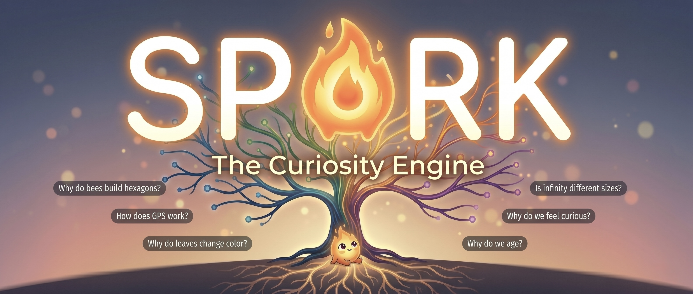

<p align="center">
  
</p>

<h1 align="center">Spark</h1>

<p align="center">
  <strong>Your curiosity engine for discovering, deep-diving, tracking, and applying what you learn.</strong><br/>
  Explore freely, build a living knowledge tree, learn with groups, and connect your interests to real-world opportunities.
</p>

<p align="center">
  <a href="#-quick-start">Quick Start</a> ·
  <a href="#-features">Features</a> ·
  <a href="#-how-it-works">How It Works</a>
</p>

<p align="center">
  
  
  
  
</p>

---

## The Problem

Most learning apps are linear and forgettable:

- You browse content, but don’t build an identity around what you’ve explored.
- You can’t easily shift from “casual curiosity” to “intentional mastery.”
- There’s weak continuity between exploration, review, and real-world application.

Spark is built to make curiosity feel **alive, cumulative, and actionable**.

## What Spark Does

Spark is a curiosity-first learning experience with five connected loops:

1. **Explore** ideas through search, discovery cards, and FreeFall swipes.
2. **Deep dive** with AI explainers, quizzes, and interactive follow-up questions.
3. **Save tracks** and move threads into deliberate mastery/review workflows.
4. **Visualize growth** in a living profile tree, timeline, and streak systems.
5. **Connect to the world** via opportunity recommendations tied to your thread fingerprint.

> **Core loop:** Discover → Save → Deepen → Review → Apply → Discover again.

---

## ⚡ Quick Start

### 1) Install

```bash
git clone <your-repo-url>
cd spark
npm install
```

### 2) Run the app

```bash
npm run dev
```

### 3) (Optional) Run local API service

```bash
npm run dev:api
```

### 4) Build for production

```bash
npm run build
```

---

## ✨ Features

### 🌳 Curiosity Engine (Explore)
- Search-driven exploration with AI-assisted follow-up prompts
- Discovery card flow and “surprise me” exploration direction
- FreeFall swipe mode for fast serendipitous topic intake
- “Explore freely” world picker plus spotlight topic expansion

### 🧠 AI Explainers + Learning Interactions
- Topic explainers generated in-context from your profile
- Inline quick quiz support
- Multiple discovery/deep-dive interaction paths

### 🧵 Tracks & Mastery
- Save any interesting node as a track
- Track care/tend/master progress
- Review workflows for sustained retention

### 👥 Groups
- Create or join collaborative topic groups
- Shared syllabus-like group progression
- Demo group seeds included for side-by-side product demos

### 🌍 Opportunities (Connect to the World)
- Opportunity suggestions generated from your thread fingerprint
- Persisted opportunity run history
- Demo mode preloads history for immediate storytelling

### 👤 Profile: Living Learning Identity
- Living tree visualization
- Journey timeline (tracks + searches + sessions)
- Streaks, activity calendar, and domain constellation
- Demo-ready profile data with rich historical depth

### 🎭 Demo Personas
- URL boot support: `?demo=alex`, `?demo=maya`, `?demo=james`
- Floating demo switcher and hotkeys (`Shift + 1/2/3`)
- Seeded tracks/sessions/searches/groups/opportunity history for each persona

### 🎨 Theming
- Global **Light/Dark mode** toggle
- Theme preference persisted in localStorage
- Theme-aware shell and key screens/components

---

## 🔧 How It Works

### High-level flow

```text
User explores topics
   ↓
Spark builds curiosity fingerprint (domains + tracks + behavior)
   ↓
User deep-dives / saves tracks / reviews knowledge
   ↓
Profile tree + timeline + streaks update over time
   ↓
Opportunities engine maps learning threads to real-world next steps
```

### Tech Stack

| Layer | Technology |
|-------|------------|
| Frontend | React + Vite |
| Styling | Tailwind CSS + custom CSS variables |
| Motion | Framer Motion |
| AI Integration | Claude API and/or Puter backend modes |
| Auth/Data Sync | Firebase (optional config) |
| Local Persistence | localStorage-based state/history/demo bootstrapping |

---

## 🌗 Theme & Demo Notes

### Dark Mode
- Toggle from the top bar (`🌙 Dark` / `☀ Light`)
- Stored as `spark_theme` in localStorage

### Demo Mode
- Boot directly with query params:
  - `http://localhost:5173/?demo=alex`
  - `http://localhost:5173/?demo=maya`
  - `http://localhost:5173/?demo=james`
- Demo mode seeds profile state and related history keys for a complete 2-minute walkthrough

---

## 🔐 Environment Variables

Copy `.env.example` to `.env` and configure as needed.

```bash
cp .env.example .env
```

Key options include:
- `VITE_AI_BACKEND=puter|claude`
- `VITE_ANTHROPIC_API_KEY=...` (when using Claude backend)
- Firebase config values (optional)

---

## 📁 Project Structure

```text
src/
├── ai/                 # AI prompt and service orchestration
├── components/         # UI primitives and feature components
│   ├── discovery/
│   ├── explainer/
│   ├── freefall/
│   ├── layout/
│   ├── mastering/
│   ├── profile/
│   ├── search/
│   ├── tracks/
│   └── tree/
├── data/               # Seed/demo data and course datasets
├── hooks/              # Context and state hooks
├── models/             # Domain models (elo, srs, user context)
├── pages/              # Main app surfaces (Explore, Tracks, Groups, etc.)
├── services/           # API/storage/topic graph integrations
├── styles/             # Global + animation styles
└── utils/              # Constants, helpers, and seed utilities
```

---

## 🚀 Scripts

```bash
npm run dev        # Start Vite app
npm run dev:api    # Start local API server
npm run build      # Production build
npm run preview    # Preview production build
npm run lint       # ESLint
```

---

## 👤 About

Spark is designed as a curiosity-first learning system that combines discovery, mastery, social learning, and real-world application in one continuous loop.

If you’re building on this repo: fork it, theme it, and make it your own.
